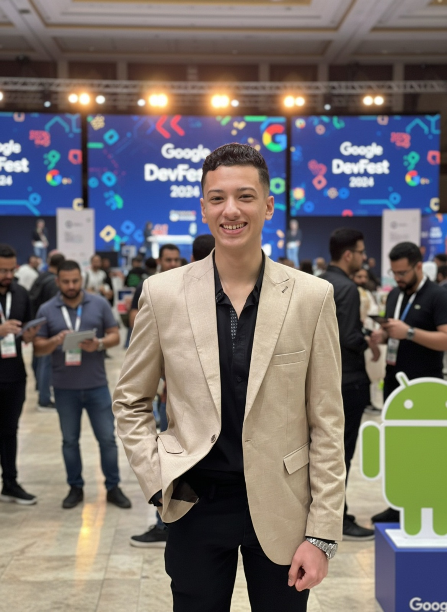
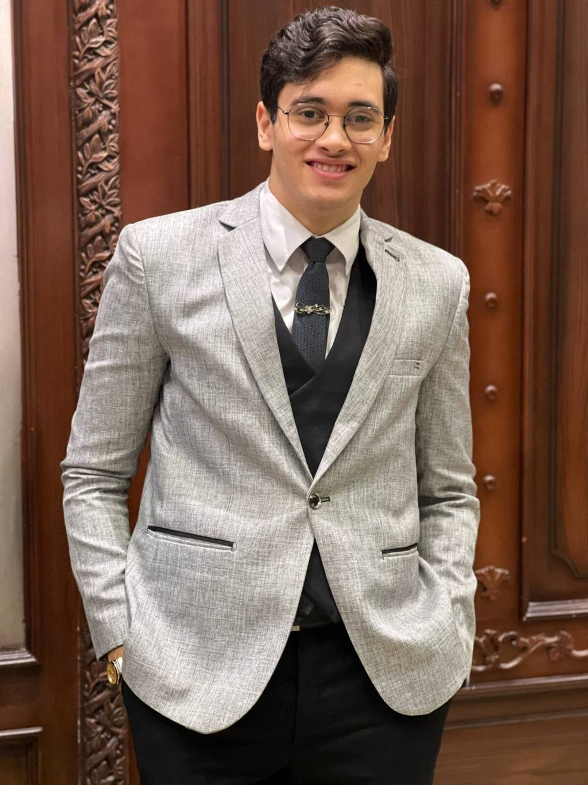
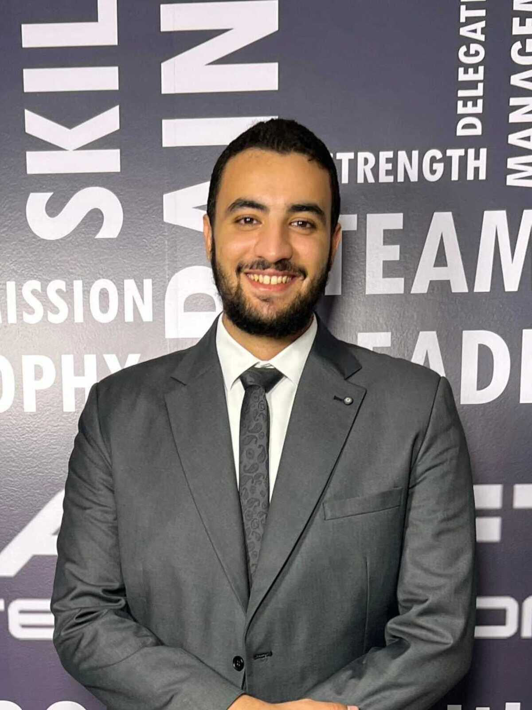

  
  

<h1 align="center">MuteMate</h1>

  <em>Breaking communication barriers and creating equal opportunities for the deaf and mute community in Egypt.</em>

  
  
  
  

---

## 🌍 Why MuteMate?  
In Egypt, many members of the deaf and mute community face daily challenges in expressing themselves and interacting with society. **MuteMate** seeks to bridge this gap by offering innovative digital tools and technologies that ensure their voices are heard, respected, and understood.  

## 🎯 Project Goals  
* **Foster Inclusion:** Accelerate social participation and integration.  
* **Remove Barriers:** Actively fight discrimination against the deaf and mute community.  
* **Empower Communication:** Provide reliable, real-time digital solutions for everyday interactions.  
* **Promote Equality:** Ensure equal opportunities in education, work, and daily life.  

---

## ✨ Features (Coming Soon)
* 🗣️ **Feature One:** Brief description of what this does (e.g., Text-to-Sign translation).
* 📱 **Feature Two:** Brief description (e.g., Real-time voice transcription).
* 🤝 **Feature Three:** Brief description (e.g., Emergency communication shortcuts).

---

## 💻 Tech Stack
* **Frontend:** [e.g., Flutter / Dart]
* **Backend:** [e.g., Python / Django]
* **Database:** [e.g., PostgreSQL / Firebase]
* **APIs & AI:** [e.g., Google Cloud Speech-to-Text]

---

## 👩‍🎓 About the Project  
This is a graduation project developed by the **Class of 2026** students from the **BIDT (Business Information & Digital Transformation)** program at **Helwan National University**.

### 👥 Meet the Team  

<table align="center">
  <tr>
    <td align="center">
       
      <b>Polla Joseph Labeeb Aziz</b>
    </td>
    <td align="center">
       
      <b>Abdelrahman Mohamed Anwer</b>
    </td>
    <td align="center">
       
      <b>Assem Ayman Mohamed Ibrahim</b>
    </td>
  </tr>
  <tr>
    <td align="center">
       
      <b>Hager Galal Ahmed Galal</b>
    </td>
    <td align="center">
       
      <b>Marllen Sery Saleh Nakhla</b>
    </td>
    <td align="center">
       
      <b>Omnia Hussein Saad Mahmoud</b>
    </td>
  </tr>
</table>

---

## 🚀 Installation & Local Setup
*(Instructions will be added here once the project architecture is finalized.)*

1. Clone the repository: `git clone https://github.com/PollaJoseph/mutemate.git`
2. Install dependencies...
3. Run the application...

---

  Developed with ❤️ by the MuteMate Team

